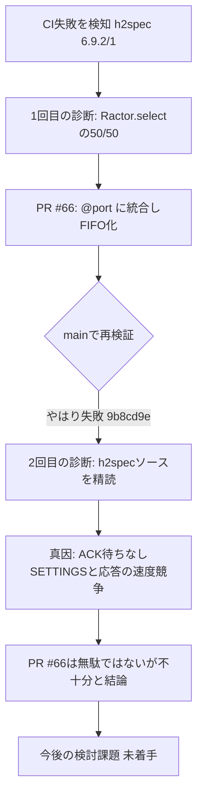
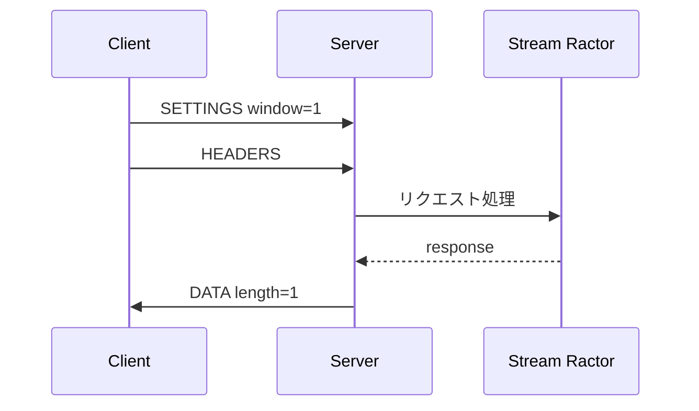
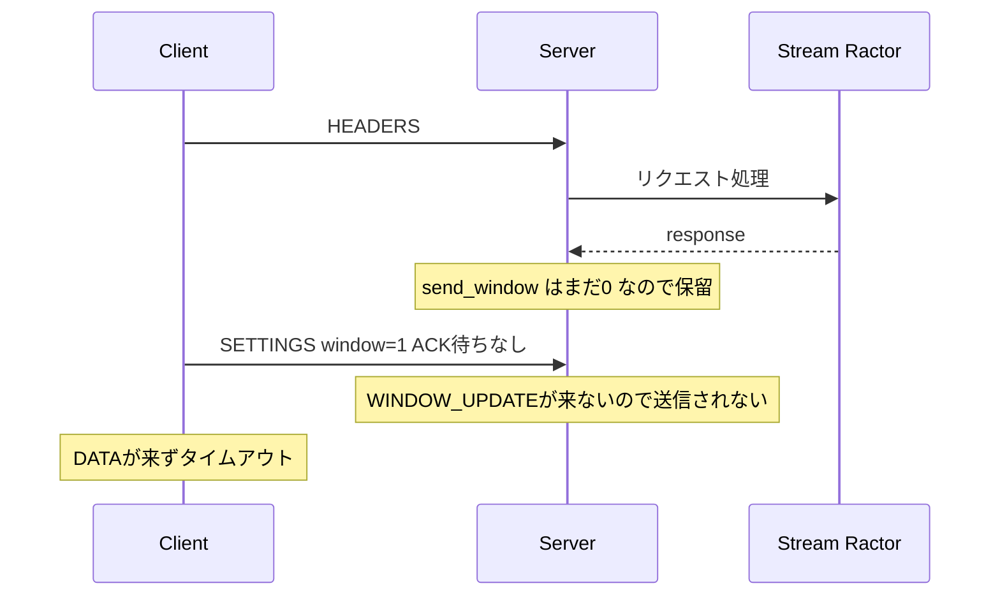

# リファクタリング TODO

biryani (HTTP/2 / HPACK 実装) のリファクタリング候補を「パフォーマンス向上」「読みやすさ向上」の2軸で整理する。

## パフォーマンス向上

- [x] **HPACK ルックアップの重複除去**（`lib/biryani/hpack/field.rb:150-154, 207-211, 286-290, 341-345`）
      `index <= STATIC_TABLE_SIZE ? STATIC_TABLE[...] : dynamic_table[...]` という同じ三項演算と境界チェックが4箇所に重複していた。→ `HPACK::DynamicTable#entry_at`/`#name_at` に切り出し済み（commit `c1d7441`）。

- [x] **パディング付きフレームの共通スライス処理**（`lib/biryani/frame/data.rb`, `headers.rb`, `push_promise.rb`）
      pad_length読み取り→fragment切り出し→padding切り出しのロジックが各フレームクラスで個別に文字列スライスされていた。→ `Frame.read_padded_payload` に切り出し済み（commit `18bf993`）。

- [x] **`Connection.default_settings` と `initialize` のマジックナンバー重複解消**（`lib/biryani/connection.rb:25-31` vs `486-496`）
      `4_096`（HPACKテーブルサイズ）、`65_535`（コネクションレベルの初期ウィンドウサイズ）が2箇所で独立にハードコードされていた。ただし `initialize` を `default_settings` ハッシュから直接導出する案は、コネクションレベルのフロー制御ウィンドウ（RFC9113 6.9.2で常に65,535固定）とストリーム単位で可変な `SETTINGS_INITIAL_WINDOW_SIZE` を誤って結合してしまうため見送り、`DEFAULT_HEADER_TABLE_SIZE`/`INITIAL_CONNECTION_WINDOW_SIZE` という意味の異なる定数として分離して重複を解消した（commit `7a1845f`）。

- [x] **Huffman/文字列処理の残存アロケーション確認**
      `hpack/huffman.rb`, `hpack/string.rb`, `hpack/integer.rb` は既存の最適化コミット群で対応済みで追加の無駄なアロケーションは見当たらなかった。一方 `data_buffer.rb#take!` で `datas += frames`（ループ毎回の配列再生成）と `frames.map(&:length).sum`（中間配列生成）を発見し、`concat`/`sum(&:length)` に置き換えて解消した（commit `67cd470`）。

> 全体として本実装はプロトコル層でありペイロード規模も大きくないため、パフォーマンス改善の余地は限定的。効果が見込めるのは HPACK のバイト単位処理と Huffman 周りのアロケーション削減が中心。

## 読みやすさ向上（優先度順）

- [x] **未定義変数参照バグ**（`lib/biryani/connection.rb:121, 138`）
      `do_recv_dispatch` および `handle_connection_frame` 内で `typ`・`stream_id` が未定義のスコープで参照されていた（`frame.f_type`・`frame.stream_id` の誤り）。該当分岐に到達すると `NameError` になる潜在バグ。→ `frame.f_type`/`frame.stream_id` を使うよう修正済み（commit `e924437`）。継続対応: continuation のストリームID不一致・コネクションレベルフレームタイプエラーのパスをカバーするspecを追加する。

- [ ] **`Connection` の神クラス化**（`lib/biryani/connection.rb` 全体、特に `handle_stream_frame`（175-225行）、`recv_dispatch`（90-114行））
      Metrics系 rubocop cop を複数同時disableしているのは分解すべきサイン。フレーム種別ごとのハンドラオブジェクト（`FrameHandlers::Data` 等）に分離し、`Frame::FRAME_MAP` のようなディスパッチテーブルで管理する。

- [ ] **パディング処理・固定長エラーメッセージの重複**（`lib/biryani/frame/*.rb`）
      `data.rb`, `headers.rb`, `push_promise.rb` のパディング解析ロジック、および `ping.rb`, `priority.rb`, `rst_stream.rb`, `window_update.rb` の "payload length MUST be N" エラーメッセージが frame名以外ほぼ同一。共通ヘルパー（`Frame.read_padded_payload`, `Frame.check_fixed_length!`）に抽出する。

- [ ] **HPACK `Field.decode` のビットマスク分岐**（`lib/biryani/hpack/field.rb:107-130`）
      6つの `elsif` によるビットパターン判定カスケードで可読性が低く、フォールバックが `raise 'unreachable'` という生文字列例外になっている。`representation(byte)` でシンボルに変換してから `case` 文で分岐させ、`raise Error::HPACKDecodeError` に置き換える。

- [ ] **`state.rb` の巨大な state machine と未実装機能の放置**（`lib/biryani/state.rb:57-218`）
      `self.next` が160行、4つのcop disable付き。`reserved_remote`/`reserved_local`（PUSH_PROMISE関連）が `# TODO` のまま状態を変更せず素通りしており、`connection.rb:203-206` の `PUSH_PROMISE: # TODO` と対応する未実装のサーバープッシュを覆い隠している。状態ごとのメソッド分割、および未実装機能は明示的にエラーを返すようにする。

- [ ] **`Connection` のクラスメソッドが実質フリー関数化**（`lib/biryani/connection.rb:257-483`）
      `transition_stream_state_recv`, `handle_data`, `handle_headers` 等がインスタンスメソッドではなく `self.` メソッドとして5〜7個の位置引数を取っている（Ractorのクロージャにインスタンス状態を持ち込まないための設計と推測されるが、可読性を損なっている）。`max_streams`, `send_initial_window_size`, `recv_initial_window_size` 等をまとめた値オブジェクト（`PeerState`/`ConnectionSettings`）を導入しパラメータ数を削減する。

- [ ] `StreamContext` と `StreamsContext` の紛らわしい命名が同一ファイル（`streams_context.rb`）に同居。命名の明確化またはファイル分割。

- [ ] `connection.rb:47-49`, `stream.rb:16-18` の `rescue StandardError => e; puts e.backtrace` によるエラー握りつぶし。最低限 `$stderr.puts` 等に置き換え、ロギング抽象を検討。

- [ ] `Window#consume!`/`increase!`/`update!`, `DynamicTable#chomp!`/`limit!`, `State#transition!` の `!` は非破壊版が存在せず装飾的。Rubyの慣習に反するため見直し。

- [ ] `http/request.rb:40-56` の `field` メソッドが7つの独立したRFCバリデーションを1メソッドに詰め込み、3つのcopをdisable。`[条件, メッセージ]` の配列反復や個別の述語メソッドへの分割を検討。

- [ ] `HTTP::Response#validate`（`http/response.rb:20-27`）だけが例外送出で、他の大半（`connection.rb`, `frame/*.rb`）は戻り値でのエラーシグナリング。一貫性のため戻り値方式への統一、または使い分けの理由をコメントで明示。

- [ ] 固定長フレーム（`Ping`, `Priority`, `RstStream`, `WindowUpdate`）の `attr_reader`/`initialize`/`length`/`to_binary_s`/`self.read` のボイラープレートがほぼ同一。共通の `FixedLengthFrame` ベースクラス化を検討（可変長フレームは対象外）。

- [ ] `2**31 - 1`（31bitストリームID上限・フロー制御ウィンドウ上限）が `connection.rb`, `frame.rb`, `frame/priority.rb`, `frame/headers.rb`, `frame/push_promise.rb`, `frame/window_update.rb` に散在。`MAX_STREAM_ID`/`MAX_WINDOW_SIZE` 定数化。

## 既知の課題（別調査）

- [ ] **h2spec `6.9.2/1 Changes SETTINGS_INITIAL_WINDOW_SIZE after sending HEADERS frame` がCIで稀に失敗する**（PR #65 / commit `f7e87e0` のJUnit Test Reportで発生）— PR #66で部分的に対処したが、根本原因は未解決と判明（再オープン）
      CI上のconformanceジョブ自体は成否を見ずに常にpassする（`conformance/server_spec.rb` の `system(h2spec)` が戻り値をチェックしていないため）が、別途JUnitレポートを解析する `mikepenz/action-junit-report` チェックがこのテストの失敗を検出した。

      **診断の流れ**

      **1回目の診断（不完全だった）**: `Ractor.select(@sock, @streams_ctx.tx)`は両方ready時に50/50でランダムに選ばれる（実測確認済み）ことが原因と考え、PR #66（commit `2bd42f9`）で`@sock`と`@streams_ctx.tx`を1つの共有ポート（`@port`）に統合し、`Ractor::Port`のFIFO性により到着順で処理されるよう修正した。副次的に、`@sock.closed?`が子Ractorの終了だけでは自動closeされず実質常に`false`のままだった別の潜在バグも発見・修正し（`:eof`メッセージによる明示的検知に変更）、`StreamsContext#initialize`の`tx`引数も必須化した。これらは独立して正当な修正だが、**この特定のCI失敗は直らなかった**（マージ後の`main`のCI実行 `9b8cd9e` でも同一テストが失敗、`https://github.com/thekuwayama/biryani/runs/95003875801`）。

      **2回目の診断（h2specソース `~/h2spec/http2/6_9_2_initial_flow_control_window_size.go` を確認して修正）**: このテストは (1) `SETTINGS_INITIAL_WINDOW_SIZE=0`を送りACKを待つ→ストリーム1の`send_window`は生成時に**0**で初期化される、(2) HEADERSを送信、(3) `SETTINGS_INITIAL_WINDOW_SIZE=1`を送るが**ACKを待たずに**即DATAフレームを待つ、(4) `length:1`のDATAを期待、という流れ。クライアントはWINDOW_UPDATEを一切送らないため、(3)のSETTINGSが処理される前に`handle_response`→`send_data`が走ると、`ctx.send_window`はまだ0のままで`sendable_datas`は0バイトしか送信可能と判断せず、"OK"を丸ごと`@data_buffer`に貯め込んで**永久にDATAを送らない**（＝タイムアウト）。CIの失敗ログは実際に`[recv] HEADERS`（レスポンス）が`[recv] SETTINGS`（ack）より先に届き、その後DATAが一切来ずタイムアウトしているのを確認した。

      両方のタイムラインを比べると次のようになる（クライアントは (3) のSETTINGSでACKを待たない点が肝）:

      成功パターン: SETTINGS(1) が HEADERS 処理より先に届く

      失敗パターン: Stream Ractor の応答が SETTINGS(1) より先に完了する

      **PR #66が効かなかった理由**: このテストの(3)は**ACK待ちをしない**ため、「クライアントが送ったSETTINGSバイトが実際にネットワークを介して届き`recv_loop`が読み終えるまでの実時間」対「Stream Ractorの極めて軽いコールバック（`res.status=200`のみ）が完了するまでの実時間」という**純粋な物理的タイミング競合**になる。PR #66のFIFOマージは「両方が同時にready担った場合のRuby内部の不定な50/50」を解消するものであり、「レスポンス計算がネットワーク到着より先に終わってしまう」という物理的な速度競争そのものは解決できない。つまりPR #66は的外れではなかった（実在する別の2つの問題を修正した点で無駄ではない）が、この特定のCI失敗を直すには**不十分**だった。

      **今後の検討課題（未着手）**: 物理的なタイミング競合を解消するには、例えば「新規ストリームの`send_window`が0の間はレスポンス送信を一定条件まで保留する」「HEADERS処理直後に一定時間・一定回数だけ`@port`をポーリングしてから応答を送る」等、レスポンス生成そのものを遅延させるアプローチが必要になる可能性が高いが、いずれもレイテンシとのトレードオフや実装の複雑化を伴うため、着手前に方針を再検討する。

      **直近PRとの関係**: 今回の4つのPR（#61〜#64）はいずれも`select_loop`/`Ractor.select`/`handle_settings`/`Stream`に触れていない。念のため4PR適用前のコミット（`8753e5a`）でも同じテストを20回実行して確認したが、こちらも20/20成功。レースの構造自体は`8753e5a`時点、少なくともそれ以前から存在しており、直近のPRが原因ではないことを確認済み。ローカル環境ではマシンのタイミング特性が一貫しているため毎回同じ順序に解決され表面化せず、CIの共有ランナーのようなスケジューリングの揺れがある環境で偶然顕在化したと考えられる。
